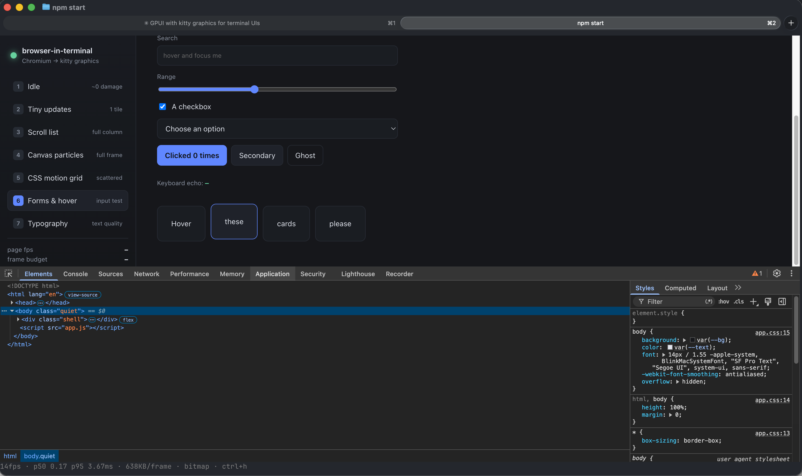

# browser-in-terminal

Stream a real Electron (Chromium) UI into a terminal that speaks the **kitty graphics protocol**,
and forward the terminal's mouse and keyboard back into the page — at 60 fps, with DevTools
rendered inside the terminal.



*That is a terminal.* Everything above the bottom line is Chromium pixels pushed over the kitty
graphics protocol — including **DevTools**, docked at the bottom and fully usable: live DOM tree,
Styles pane, element selection. The bottom line is real terminal text, drawn on top.

It reads `14fps` because nothing on the page is moving. The DOM tree in the shot shows why —
`<body class="quiet">` is the class that parks animation on non-animating panels, so only the
frames that hover and focus actually dirtied were drawn. An idle UI costs nothing; that is the
property the whole design is built around.

```
Chromium OSR ─paint(dirtyRect, BGRA)─▶ hash tiles ─▶ changed only ─▶ RGBA ─▶ shm ─▶ terminal
     ▲                                                                                │
     └────────── sendInputEvent ◀── SGR-pixels mouse / kitty keyboard ◀────────────────┘
```

This is a **worked example**, not a library. It exists to answer one question end to end: *can you
put a real browser UI in a terminal and have it feel good?* The answer is yes, at **156 KB and
0.10 ms per frame** for a typical UI — but only because of three measured findings that are not
obvious, all documented below and in **[PERF.md](PERF.md)**.

## Requirements

| | |
|---|---|
| **Terminal** | Must implement the kitty graphics protocol. Developed and tested against **Ghostty** on macOS. kitty and WezTerm implement the protocol but are **untested here**. |
| **OS** | macOS (developed and tested). The shared-memory path is plain POSIX and should build on Linux, but that is **untested**. `--texture` is macOS-only (IOSurface). |
| **Runtime** | Node 22+, Electron 44. Python 3 for the benchmark and test harnesses. |
| **Shell** | Must run on a real TTY, not a pipe. |

## Quickstart

```bash
npm install                   # builds the native addon against Electron headers
npm start                     # CPU bitmap + damage tracking + shm (the default, and the fastest)
npm start -- --texture        # GPU shared texture (IOSurface) — slower in practice; see below
```

If your terminal does not advertise the protocol, startup aborts with an explanation. `--force`
skips the check.

## The approach

### 1. Get frames out of Chromium

Chromium renders **offscreen** (`offscreen: true`). Every `paint` event delivers a BGRA bitmap plus
a dirty rect. The window is sized so Chromium's device pixels match the terminal's pixels exactly —
and the scale factor is *measured* from the first paint (`bitmap.length` vs `image.getSize()`)
rather than assumed, because assuming it is wrong on mixed-DPI setups.

### 2. Find what actually changed — the finding that makes this viable

**Chromium's dirty rect is the union of all damage.** Three small changes in different corners of
the page report as one 1174×660 rectangle. Sending that rect is sending most of the screen.

So the rect is used only to *narrow the search*. The viewport is divided into cell-aligned tiles;
tiles inside the dirty rect are hashed (FNV-1a, in the native addon), and only tiles whose pixels
genuinely changed are converted and transmitted.

> **5625 KB → 156 KB per frame. Frame cost 0.63 ms → 0.10 ms.**

Each tile keeps a *stable* kitty image id and is redrawn at the same cell, so a replacement always
covers exactly the area it replaced — no stale holes. If damage exceeds 45% of tiles, one full-frame
upload beats N tile uploads and the code switches automatically.

### 3. Get the pixels across cheaply

Two transports, probed at startup:

- **Shared memory** (kitty `t=s`) — the addon creates a POSIX shm object and converts BGRA→RGBA
  *straight into the mapping*. The bytes never enter JavaScript. This is the default and it is fast.
- **Inline zlib+base64** (`f=24`, chunked) — the fallback. Works anywhere, including over SSH, and
  costs ~14 ms/frame for full-viewport animation.

Shared memory **silently does nothing when the terminal is on another machine**, so the app actively
probes it (`a=q,t=s`) at startup instead of assuming, and the status line reports what is *actually*
in use — not what was requested.

### 4. Get input back in

Terminal input is translated into Chromium input events: SGR-pixels mouse (`?1016h`) for exact
pixel coordinates, any-motion reporting for hover, and the **kitty keyboard protocol** (`CSI >27u`,
flags `1|2|8|16`) for key press/repeat/release with associated text. Motion events are coalesced to
the newest per frame — forwarding all 300 events in a drag synchronously is what made dragging lag.

Two things terminals cannot deliver had to be rebuilt **inside the page**: the right-click context
menu and `<select>` dropdowns are native OS widgets that offscreen rendering never exposes, so both
are drawn into the DOM in a closed shadow root.

### 5. Keep the GPU idle

A static page should cost nothing. Three things were violating that, and all three are fixed: the
renderer ran at 120 fps against a 60 Hz display; the demo page's own animations never idled; and
losing terminal focus (`?1004h`) did not throttle anything. Combined, a static page went from ~600
frames per 5 s to **0**.

### What we tried and rejected

- **`useSharedTexture` (GPU zero-copy).** It *disables Chromium's damage reporting* — 357/357 paints
  come back full-frame vs 1/357. Avoiding a GPU readback is worth far less than not sending 5.6 MB.
  Kept as `--texture`, but the CPU path is the default.
- **`--disable-frame-rate-limit`.** Destroys damage tracking: 5302 of 5321 paints become full-frame.
- **Adaptive transport switching.** Built, then removed — it silently reloads the page and its
  signal is degenerate.

## Repo map

```
src/main.ts          the bridge: paint loop, damage, transports, DevTools, input routing
src/surface.ts       a rectangle with its own tiler and kitty id range (page | DevTools)
src/framebuffer.ts   cell-aligned tiling — laid out in cell space, not pixel space
src/terminal.ts      capability probe, raw-mode guard, terminal setup/teardown
src/input.ts         SGR mouse + kitty keyboard parser → Electron events
src/kitty.ts         the graphics protocol escapes
src/metrics.ts       histograms and rate baselines
src/menu.ts          in-page context menu   src/selectshim.ts  in-page <select>
native/src/addon.cc  shm_open/mmap, BGRA→RGBA, tile hashing, IOSurface, stderr redirect
bench/bench.py       benchmark matrix        bench/smoke.py     29 end-to-end checks
bench/visual.py      pixel-exact ground-truth diff against Chromium's own frame
bench/kitty_compositor.py  a reference terminal that composites what we send
```

## Commands

```bash
npm start          # run it (from a kitty/ghostty shell, not a pipe)
npm run verify     # typecheck + test + shim + smoke + visual  (~6 min)
npm test           # 34 unit tests: parser, tiler, escapes, metrics, surfaces, shims
npm run shim       # in-page select and context menu, against real Chromium
npm run visual     # reconstruct the screen and diff it against Chromium's frame
npm run smoke      # end-to-end against a synthetic terminal
npm run bench      # benchmark matrix, prints percentiles
```

Useful flags: `--texture`, `--fps=N`, `--unfocused-fps=N`, `--tile-cols/--tile-rows`, `--mode=0..3`,
`--scenario=<panel>`, `--duration=<s>`, `--warmup=<s>`, `--metrics=<path>`,
`--devtools-dock=right|left|bottom|top`, `--devtools-split=0.55`, `--devtools-port=9223`, `--force`.

## Controls

| Key | Action |
|---|---|
| `ctrl+1` / `ctrl+2` | full-frame — inline zlib+base64 / shared memory |
| `ctrl+3` / `ctrl+4` | dirty tiles — inline zlib+base64 / shared memory (default) |
| `ctrl+t` | toggle the GPU shared-texture path |
| `ctrl+i` | open/close DevTools, rendered inside the terminal |
| `ctrl+o` | cycle the DevTools dock: right → left → bottom → top |
| `ctrl+h` | toggle the stats line |
| `ctrl+r` / `ctrl+q` | reload the page / quit |
| `1`–`7` | switch demo panel (when the page has focus) |

The seven demo panels are chosen to produce deliberately different damage profiles: a static page,
tiny frequent updates, a scrolling list, full-viewport canvas particles, scattered CSS motion, a
form, and a typography page.

## DevTools

`ctrl+i` renders DevTools **inside the terminal** beside the page, docked on any edge — it is just a
second `WebContents` on a second `Surface` with its own tile id range. Alternatively
`--devtools-port=9223` exposes Chrome's remote debugging endpoint so full DevTools attaches from a
browser; because the inspector's highlight overlay is drawn by Chromium *into the page*, hovering a
node in the browser lights it up in the terminal.

## Headline numbers

Application cost at 1600×900, 60 fps cap (`npm run bench`; terminal-side decode excluded):

| case | fps | frame p50 | p95 | KB/frame |
|---|---|---|---|---|
| idle | 0.0 | 0.00 | 0.00 | **0** |
| tiny updates | 59.8 | **0.10** | 0.16 | **156** |
| scroll / motion | 60.0 | 0.64 | 0.80 | 2344 |
| canvas particles | 60.0 | 0.61 | 0.74 | 2148 |
| canvas, shared texture | 60.0 | 0.66 | 0.76 | 2188 |
| canvas, inline base64 | 60.0 | 14.17 | 15.28 | 484 |


The worst case, for contrast: **Canvas particles** changes the whole viewport every frame, so
damage tracking cannot help and the cost jumps to 14.3 MB/frame at a 3098×1818 surface. That panel
exists precisely to establish the upper bound.

Measured in real Ghostty over 30 s at 1328×1598: shared memory active, frame p50 **0.16 ms**,
638 KB/frame median, 77.5 MiB/s, 60 fps sustained.

**A note on the methodology, because it changed the conclusions.** Pointing the harness at itself
showed *identical code* swinging −86% to +34% on p95 while bytes held at +0%. Wall-clock percentiles
on a contended laptop are noise. Regression gating therefore uses **p50 and bytes**, over
`--repeat 3` medians. Full methodology in [PERF.md](PERF.md).

## What terminal input can express

Everything below is implemented and unit-tested (`InputParser`).

| Capability | Mechanism |
|---|---|
| Left / **right** / middle click, drag, hover | SGR button bits, any-motion (`?1003h`) |
| Context menu | right-release → Electron `contextMenu` → drawn in-page |
| **Double / triple click** | terminals never report click counts — synthesized from <500 ms + <4 px |
| Back / forward mouse buttons | SGR bit 128 → `navigationHistory` |
| Vertical + **horizontal** wheel | codes 64/65 and tilt 66/67 (ticks only) |
| Key **press, repeat and release** + text | kitty keyboard flags `1\|2\|8\|16` |
| Arrows, F1–F24, Home/End/Page, keypad | legacy CSI + kitty functional codes |
| Paste, focus in/out | bracketed paste (`?2004h`), `?1004h` |
| **`<select>` dropdowns** | native popup intercepted, listbox drawn in-page |
| **Blinking caret in text fields** | `focusOnWebView()` — an offscreen view is otherwise unfocused |
| Clipboard out | OSC 52 |

Genuinely **not** expressible through a terminal:

| Missing | Why | Consequence |
|---|---|---|
| Pixel-precise scroll deltas | the protocol reports wheel *ticks* | no trackpad-smooth scrolling |
| IME, dead keys, compose | no protocol for preedit state | no CJK input, no accented composition |
| OS drag-and-drop | nothing crosses the terminal boundary | can't drop a file onto the page |
| Pressure / tilt / touch | not in any terminal protocol | no stylus, pinch-zoom, or multitouch |
| Autofill and other Chromium popups | native widgets OSR does not expose | not shown |
| Pointer capture outside the window | motion is only reported inside | drags leaving the pane stop reporting |
| Modifier-only keypresses | Electron has no standalone keyCode | modifier state rides other events |

## Design notes

- **Tiles are laid out in cell space, using the terminal's *reported* cell size** (`CSI 16 t`), not
  `pixelWidth / columns`. Computing tile origins in pixels drifts with fractional cell sizes and
  leaves stale content on screen — a bug class a whole-number test harness cannot see.
- **A kitty image id is a z-order.** At equal `z`, a higher id composites on top, so tiles floated
  above a newer full frame. Full frames now retire the entire tile id range, not just tracked ids.
- **Images are placed at `z=-1`**, below text, so the terminal-drawn status line stays readable.
- **Electron forbids external Buffers** (V8 sandbox), so the entire shm write happens inside the
  addon — which also removes a copy. A ring of 65536 names bounds any leak from a terminal that does
  not unlink, and retention is reclaimed **by bytes, not object count**.
- **IOSurface, not Metal.** Electron's shared texture arrives as an `IOSurfaceRef`; on Apple silicon
  that surface is CPU-addressable, so `IOSurfaceLock` + a row-wise swizzle suffices.
- **Chromium logs to fd 2 from C++**, which JavaScript cannot intercept — and they draw straight
  across the rendered frame. The addon `dup2`s stderr away.
- **Raw mode is guarded**, because libuv short-circuits `uv_tty_set_mode` when its cached mode
  matches: `setRawMode(true)` can be a silent no-op. The guard reads the real state via `tcgetattr`
  and toggles through cooked to force the change.

## Known gaps

- Wheel events are terminal *ticks*, not pixel deltas, so scrolling is coarser than a trackpad.
- No IME / dead-key support.
- Text is pixels, not terminal cells: not selectable, invisible to tmux, no screen reader.
- The reference compositor models the kitty *spec*, so a terminal-specific deviation would pass.
- Terminal-side decode cost is excluded from the benchmarks by design (it is not ours to control),
  but it is real — see the GPU section of [PERF.md](PERF.md).
- The SSH fallback is probed and unit-tested, but has never been run over a real SSH connection.

## License

MIT © James Lal
